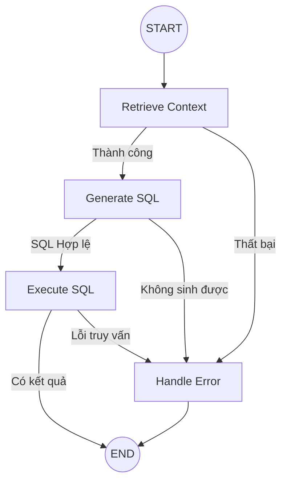

# Kế hoạch Nâng cấp Đồ thị Agent (Version 2) - Error Handling & Branching

Bản kế hoạch này mô tả cách triển khai luồng xử lý có điều kiện, giúp Agent hoạt động thông minh và ổn định hơn.

## 1. Mục tiêu
- Tách biệt logic điều hướng (Edges) ra khỏi cấu trúc đồ thị.
- Thêm Node xử lý lỗi trung tâm (`handle_error`).
- Kiểm soát luồng chạy: Chỉ thực thi bước tiếp theo nếu bước trước đó thành công.

---

## 2. Cấu trúc File đề xuất (Minh bạch hóa)
Để giữ cho mã nguồn sạch sẽ, chúng ta sẽ tổ chức như sau:
1.  **`agent/state.py`**: Bổ sung các trường `sql_success`, `retry_count`, `error_type`.
2.  **`agent/nodes.py`**: Định nghĩa các node (gọi đến logic lõi).
3.  **`agent/edges.py` (Mới)**: Chứa các hàm logic điều kiện (`should_continue`, `check_sql_result`).
4.  **`agent/graph.py`**: Chỉ đóng vai trò "lắp ghép" các node và edge lại với nhau.

---

## 3. Quy trình thực hiện Step-by-Step

### Bước 1: Cập nhật AgentState
Thêm các biến trạng thái để điều hướng:
- `sql_success`: Boolean để biết node trước chạy tốt không.
- `retry_count`: Để hỗ trợ tự động sửa lỗi SQL (Self-correction) sau này.

### Bước 2: Tạo `agent/edges.py`
Tách toàn bộ các hàm `after_retrieve`, `after_generate`, `after_execute` vào đây. 
- **Ví dụ**: Hàm `after_generate` sẽ kiểm tra nếu SQL bắt đầu bằng `-- NO_QUERY_POSSIBLE` thì rẽ nhánh sang `handle_error` thay vì chạy vào database.

### Bước 3: Tạo Node `handle_error` trong `nodes.py`
Node này có nhiệm vụ tổng hợp thông tin lỗi và định dạng lại để trả về cho người dùng một cách thân thiện nhất (không chỉ là quăng ra một cái Exception).

### Bước 4: Lắp ghép lại trong `graph.py`
Sử dụng `workflow.add_conditional_edges()` để kết nối các node.

---

## 4. Sơ đồ luồng hoạt động (V2)



---

## 5. Danh sách công việc (Checklist)
- [x] Cập nhật `AgentState` trong `state.py`.
- [x] Tạo file `agent/edges.py` và viết logic rẽ nhánh.
- [x] Thêm node `handle_error` vào `nodes.py`.
- [x] Cấu hình lại `graph.py` sử dụng `add_conditional_edges`.
- [ ] Kiểm thử với trường hợp "Câu hỏi không có trong database" để xem Agent có rẽ vào nhánh Error không.


- Code DEEPSEEK đề xuất
```python
# agent/graph.py
from langgraph.graph import StateGraph, END
from agent.state import AgentState
from agent.nodes import (
    retrieve_context_node,
    generate_sql_node,
    execute_sql_node,
    handle_error_node
)

def build_sql_agent_graph() -> StateGraph:
    workflow = StateGraph(AgentState)
    
    # Thêm nodes
    workflow.add_node("retrieve_context", retrieve_context_node)
    workflow.add_node("generate_sql", generate_sql_node)
    workflow.add_node("execute_sql", execute_sql_node)
    workflow.add_node("handle_error", handle_error_node)
    
    # Entry point
    workflow.set_entry_point("retrieve_context")
    
    # Conditional edges sau retrieve_context
    def after_retrieve(state: AgentState) -> str:
        if state.get("error") is None and state.get("context"):
            return "generate_sql"
        else:
            return "handle_error"
    
    workflow.add_conditional_edges(
        "retrieve_context",
        after_retrieve,
        {
            "generate_sql": "generate_sql",
            "handle_error": "handle_error"
        }
    )
    
    # Conditional edges sau generate_sql
    def after_generate(state: AgentState) -> str:
        if state.get("sql_success") and state.get("generated_sql") and not state["generated_sql"].startswith("-- NO_QUERY_POSSIBLE"):
            return "execute_sql"
        else:
            return "handle_error"
    
    workflow.add_conditional_edges(
        "generate_sql",
        after_generate,
        {
            "execute_sql": "execute_sql",
            "handle_error": "handle_error"
        }
    )
    
    # Conditional edges sau execute_sql
    def after_execute(state: AgentState) -> str:
        if state.get("sql_success") and state.get("sql_result") is not None:
            return END
        else:
            return "handle_error"
    
    workflow.add_conditional_edges(
        "execute_sql",
        after_execute,
        {
            END: END,
            "handle_error": "handle_error"
        }
    )
    
    # handle_error dẫn đến END
    workflow.add_edge("handle_error", END)
    
    return workflow.compile()

# ========== SỬ DỤNG ==========
if __name__ == "__main__":
    app = build_sql_agent_graph()
    
    initial_state = {
        "query": "Tìm top 5 sản phẩm bán chạy nhất tháng 1 năm 2025",
        "context": None,
        "generated_sql": None,
        "sql_result": None,
        "error": None,
        "sql_success": False,
        "retry_count": 0
    }
    
    final_state = app.invoke(initial_state)
    print("SQL:", final_state.get("generated_sql"))
    print("Result:", final_state.get("sql_result"))
    print("Error:", final_state.get("error"))
```
