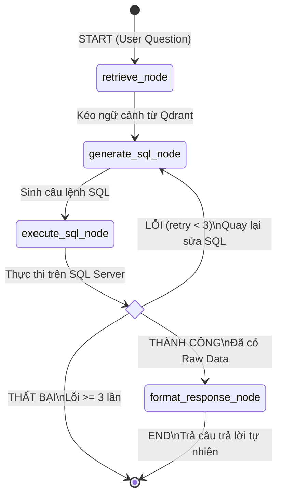

# Kế hoạch Triển khai AI Chatbot API (FastAPI + LangGraph + RAG)

Tài liệu này vạch ra kiến trúc và lộ trình triển khai hệ thống AI Chatbot, chuyển đổi từ ASP.NET Core sang hệ sinh thái Python với FastAPI và LangChain. Lõi của hệ thống là một Agentic Workflow sử dụng LangGraph để thực hiện RAG và Self-Correction (tự động sửa lỗi SQL).

---

## 1. Kiến trúc & Công nghệ (Tech Stack)

- **API Framework:** FastAPI, Uvicorn (Web server tốc độ cao, dễ test).
- **LLM & RAG:** LangChain, `langchain-google-vertexai` (hoặc `langchain-google-genai`), `langchain-qdrant`.
- **Agent Orchestration:** LangGraph (Đảm nhiệm vai trò quản lý luồng, State và vòng lặp Self-Correction).
- **Database Connection:** SQL Server thông qua `pyodbc` hoặc `sqlalchemy`.
- **Vector DB:** Qdrant (Lưu trữ mô tả bảng và rule).

---

## 2. Cấu trúc thư mục (Directory Structure)

```text
chatbot_api/
├── main.py                 # File gốc chạy server FastAPI (Uvicorn)
├── api/
│   └── routes.py           # Định nghĩa các Endpoint (POST /ask)
├── core/
│   └── config.py           # Load cấu hình & biến môi trường (.env)
├── rag/
│   └── qdrant_retriever.py # LangChain Qdrant Retriever lấy ngữ cảnh
├── agent/
│   ├── state.py            # Định nghĩa Graph State (Dữ liệu luân chuyển)
│   ├── nodes.py            # Logic các Node: retrieve, generate_sql, execute, format
│   └── graph.py            # Nối các Nodes bằng Edges (Điều hướng rẽ nhánh/vòng lặp)
├── tools/
│   └── sql_executor.py     # Cấu hình kết nối & hàm thực thi SQL
└── requirements.txt        # Danh sách các thư viện cần cài đặt
```

---

## 3. Thiết kế Luồng Agentic (LangGraph Workflow)

Quy trình được thiết kế dưới dạng **State Machine** (Đồ thị có hướng) bao gồm các Trạng thái, Điểm nút (Node) và Điều hướng (Edge):

### A. Định nghĩa Trạng thái (Graph State)
Lưu trữ bối cảnh của 1 request:
- `question`: Câu hỏi từ User.
- `context`: Ngữ cảnh dữ liệu kéo từ Qdrant.
- `sql_query`: Câu lệnh SQL được LLM sinh ra.
- `sql_error`: Thông báo lỗi SQL (nếu có).
- `raw_data`: Dữ liệu thô từ database.
- `final_answer`: Trả lời bằng ngôn ngữ tự nhiên cuối cùng.
- `retry_count`: Số lần thử lại để chống lặp vô tận (Self-Correction loop limit).

### B. Các Bước (Nodes)
1. **`retrieve_node`**: Nhúng `question` thành vector -> Search Qdrant -> Cập nhật vào `context`.
2. **`generate_sql_node`**: Đưa `question` + `context` (cùng `sql_error` nếu đang retry) vào Prompt -> Gọi LLM -> Sinh `sql_query`.
3. **`execute_sql_node`**: Mở kết nối SQL Server và chạy `sql_query`.
4. **`format_response_node`**: Đưa `raw_data` và `question` cho LLM tóm tắt/định dạng thành câu trả lời tự nhiên.

### C. Điều hướng rẽ nhánh & Vòng lặp (Edges)
- Luồng chính: `START` -> `retrieve_node` -> `generate_sql_node` -> `execute_sql_node`.
- Tại `execute_sql_node` áp dụng **Conditional Edge** (Điều kiện rẽ nhánh):
  - **LỖI:** Nếu tồn tại `sql_error` VÀ `retry_count < 3` ➡️ Quay ngược lại `generate_sql_node` để sửa lỗi.
  - **THÀNH CÔNG:** Nếu không có lỗi ➡️ Đi tiếp tới `format_response_node`.
  - **THẤT BẠI (Quá giới hạn):** Nếu lỗi >= 3 lần ➡️ Dừng lại và báo lỗi để không treo hệ thống.
- Kết thúc: `format_response_node` -> `END`.

**Sơ đồ luồng đi (LangGraph Flowchart):**


---

## 4. Lộ trình triển khai (Step-by-Step)

| Bước | Tên công việc | Chi tiết |
|---|---|---|
| **1** | Khởi tạo Dự án | Setup folder `chatbot_api`, tạo môi trường ảo (venv) và cài đặt `requirements.txt`. |
| **2** | Cấu hình & Công cụ | Tạo `core/config.py` đọc `.env`. Viết `tools/sql_executor.py` để test kết nối SQL Server thành công. |
| **3** | Xây dựng RAG Retrieval | Hoàn thiện `rag/qdrant_retriever.py`: Cấu hình Qdrant Retriever của LangChain để query được context. |
| **4** | Định nghĩa Agent Nodes | Viết các hàm logic cho `retrieve_node`, `generate_sql_node`, `execute_sql_node`, `format_response_node` trong `agent/nodes.py`. |
| **5** | Đóng gói Agent Graph | Xây dựng `agent/graph.py` nối các Nodes lại, cài đặt logic rẽ nhánh Self-Correction. |
| **6** | Tích hợp FastAPI | Viết endpoint `POST /ask` trong `api/routes.py` gọi LangGraph invoke. Cấu hình `main.py`. |
| **7** | Testing | Dùng Swagger UI của FastAPI hoặc Postman để kiểm thử các luồng Thành công và luồng Self-Correction. |

### Chi tiết Bước 1: Khởi tạo Dự án & Môi trường

**1.1. Tạo cấu trúc thư mục gốc và môi trường ảo (Terminal/PowerShell):**
```powershell
# Chuyển vào thư mục gốc dự án
cd e:\thuctap\AI-Chatbot-SQL-Query

# Tạo thư mục cho API
mkdir chatbot_api
cd chatbot_api

# Tạo môi trường ảo (venv)
python -m venv venv

# Kích hoạt môi trường ảo (PowerShell)
.\venv\Scripts\Activate.ps1
```

**1.2. Tạo file `requirements.txt` và cài đặt thư viện:**
Tạo file `requirements.txt` trong thư mục `chatbot_api` với nội dung:
```text
fastapi
uvicorn
pydantic
python-dotenv
langchain
langgraph
langchain-google-vertexai
langchain-qdrant
pyodbc
```
Sau đó chạy lệnh cài đặt:
```powershell
pip install -r requirements.txt
```

**1.3. Cấu hình biến môi trường (`.env`):**
Tạo file `.env` tại thư mục `chatbot_api`:
```env
# Xác thực Google (Vertex AI / Gemini)
GOOGLE_API_KEY="your-api-key"
# Hoặc nếu dùng Vertex AI bằng Service Account:
# GOOGLE_APPLICATION_CREDENTIALS="path/to/key.json"

# Kết nối SQL Server
SQL_SERVER="localhost,1433"
SQL_DATABASE="ChatBotDB"
SQL_USER="sa"
SQL_PASSWORD="YourStrong@Passw0rd"

# Kết nối Qdrant
QDRANT_URL="http://localhost:6333"
```

**1.4. Khởi tạo cấu trúc thư mục rỗng bên trong `chatbot_api`:**
```powershell
mkdir api, core, rag, agent, tools
New-Item main.py, api/routes.py, core/config.py, rag/qdrant_retriever.py, agent/state.py, agent/nodes.py, agent/graph.py, tools/sql_executor.py -ItemType File
```
*(Ghi chú: Lệnh `New-Item` áp dụng cho PowerShell để tạo các file rỗng chuẩn bị cho các bước code chi tiết).*

---

### Chi tiết Bước 2: Cấu hình & Kết nối CSDL

**2.1. Cấu hình biến môi trường (`core/config.py`):**
File này sử dụng `dotenv` để load và cung cấp cấu hình tập trung cho toàn bộ dự án.

```python
import os
from dotenv import load_dotenv

# Load file .env
load_dotenv()

class Settings:
    # Xác thực Google (Vertex AI / Gemini)
    GOOGLE_API_KEY = os.getenv("GOOGLE_API_KEY")
    
    # Kết nối Qdrant
    QDRANT_URL = os.getenv("QDRANT_URL", "http://localhost:6333")
    
    # Kết nối SQL Server
    SQL_SERVER = os.getenv("SQL_SERVER", "localhost,14330")
    SQL_DATABASE = os.getenv("SQL_DATABASE", "ChatBotDB")
    SQL_USER = os.getenv("SQL_USER", "sa")
    SQL_PASSWORD = os.getenv("SQL_PASSWORD", "")

    @property
    def sql_connection_string(self):
        # Tạo chuỗi kết nối PyODBC cho SQL Server
        return (
            f"DRIVER={{ODBC Driver 17 for SQL Server}};"
            f"SERVER={self.SQL_SERVER};"
            f"DATABASE={self.SQL_DATABASE};"
            f"UID={self.SQL_USER};"
            f"PWD={self.SQL_PASSWORD};"
            "TrustServerCertificate=yes;"
        )

settings = Settings()
```

**2.2. Xây dựng công cụ thực thi SQL (`tools/sql_executor.py`):**
Đây là một "Tool" quan trọng trong Agentic Workflow. Nó nhận câu SQL từ AI, chạy thử vào SQL Server và trả về kết quả. Nếu lỗi, nó sẽ văng Exception (văng lỗi) để Graph bắt được và đưa vào luồng tự sửa lỗi (Self-Correction).

```python
import pyodbc
from core.config import settings

def execute_sql_query(query: str) -> list[dict] | str:
    """
    Thực thi câu lệnh SQL trên SQL Server.
    Nếu gặp lỗi cú pháp hay bảng không tồn tại, sẽ ném ra RuntimeError để Agent bắt và sửa lại.
    """
    try:
        # Cấm các câu lệnh phá hoại (Chỉ cấp quyền SELECT để an toàn 100%)
        lower_query = query.lower()
        forbidden_keywords = ["drop ", "delete ", "truncate ", "update ", "insert ", "alter "]
        if any(keyword in lower_query for keyword in forbidden_keywords):
            raise ValueError("Lỗi bảo mật: Chỉ cho phép câu lệnh SELECT.")

        # Mở kết nối
        conn = pyodbc.connect(settings.sql_connection_string)
        cursor = conn.cursor()
        
        cursor.execute(query)
        
        # Xử lý trường hợp câu query không trả về bảng (không fetch được)
        if cursor.description is None:
            conn.close()
            return "Query thực thi thành công nhưng không có dữ liệu trả về."

        # Lấy header (tên cột)
        columns = [column[0] for column in cursor.description]
        
        # Lấy data
        rows = cursor.fetchall()
        
        # Parse thành List các Dictionary để AI dễ đọc (vd: [{"id": 1, "name": "A"}])
        result = [dict(zip(columns, row)) for row in rows]
        
        conn.close()
        return result

    except pyodbc.Error as e:
        # Bắt các lỗi của SQL Server (vd: Invalid object name, Syntax error)
        raise RuntimeError(f"Lỗi SQL Execution: {str(e)}")
    except Exception as e:
        raise RuntimeError(f"Lỗi Hệ thống: {str(e)}")

# Khối code này giúp bạn có thể chạy file độc lập (python tools/sql_executor.py) để test kết nối
if __name__ == "__main__":
    try:
        test_query = "SELECT TOP 1 * FROM INFORMATION_SCHEMA.TABLES"
        print("Đang kiểm tra kết nối SQL Server...")
        data = execute_sql_query(test_query)
        print("✅ Kết nối SQL Server thành công! Dữ liệu mẫu nhận được:")
        print(data)
    except Exception as ex:
        print("❌ Kết nối thất bại, chi tiết lỗi:")
        print(ex)
```
