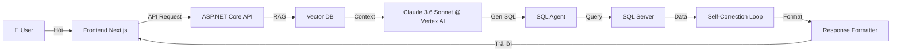

# 🤖 AI Chatbot - Hệ thống Báo cáo Sản xuất Thông minh (6-Week Roadmap)

## 1. Mục tiêu
Xây dựng AI Chatbot cho phép người dùng hỏi bằng ngôn ngữ tự nhiên (VD: *"Top 5 lỗi của chuyền 1 hôm nay?"*) và nhận kết quả số liệu chính xác từ SQL Server trong 5-10 giây.

---

## 2. Đề xuất Công nghệ & Hạ tầng (Tech Stack)

- **Mô hình LLM:** Claude 3.6 Sonnet (via Google Cloud Vertex AI).
- **Framework Backend:** ASP.NET Core API (.NET 8/9).
- **Lưu trữ Từ điển Dữ liệu (Vector DB):** Qdrant.
- **Hạ tầng Dữ liệu:** SQL Server (OLAP Read-only cho AI).
- **Ngân sách LLM:** Tối đa 600$/tháng.
- **Hosting:** Sẽ quyết định sau (Tùy chọn: Azure, AWS, hoặc On-premise).

---

## 3. Tổng quan Kiến trúc

---

## 4. 👥 Phân công Thành viên

| Thành viên | Vai trò chính | Trách nhiệm |
|------------|--------------|-------------|
| **Tuấn** | Backend Lead & AI Engineer | Tích hợp Vertex AI, RAG pipeline, Agent logic, Prompt engineering. |
| **Khoa** | Data Engineer | Schema SQL Server, ETL pipeline, Data Dictionary, Format kết quả. |
| **Dũng** | Frontend Developer | Chat UI, Visualization, API integration, UX. |
| **Nam** | Backend Developer | ASP.NET Core API, Auth, SQL Execution, Docker, CI/CD. |

---

## 5. 📅 Timeline Dự án (6 tuần)

> [!IMPORTANT]
> **Lịch nghỉ lễ Việt Nam (Nghỉ theo quy định):**
> - **Giỗ Tổ Hùng Vương**: Nghỉ 26/04 & 27/04.
> - **Ngày Giải phóng & Quốc tế Lao động**: Nghỉ 30/04 & 01/05.

### Giai đoạn 1: Foundation & Setup (Tuần 1-2: 21/04 → 04/05)
*Mục tiêu: Hoàn thiện môi trường code và cấu trúc dữ liệu.*

| # | Task | Người thực hiện | Deadline |
|---|------|----------------|----------|
| 1.1 | Khởi tạo Project ASP.NET Core API & Docker Compose (SQL Server, Qdrant). | **Nam** | 24/04 |
| 1.2 | Thiết kế Schema SQL Server (OLAP) & Seed dữ liệu mẫu thực tế. | **Khoa** | 28/04 |
| 1.3 | Soạn Data Dictionary (Mô tả metadata cho AI) & Embedding vào Vector DB. | **Tuấn** | 29/04 |
| 1.4 | Xây dựng UI Chat Skeleton & Design System (Next.js). | **Dũng** | 29/04 |
| 1.5 | Cấu hình Vertex AI SDK (Claude 3.6 Sonnet) trong .NET. | **Tuấn** | 04/05 |

---

### Giai đoạn 2: AI Engine & SQL Agent (Tuần 3-4: 05/05 → 18/05)
*Mục tiêu: AI có khả năng truy vấn dữ liệu chính xác.*

| # | Task | Người thực hiện | Deadline |
|---|------|----------------|----------|
| 2.1 | Xây dựng RAG Module: Lấy ngữ cảnh dữ liệu từ Vector DB. | **Tuấn** | 08/05 |
| 2.2 | SQL Agent Logic: Chuyển câu hỏi -> SQL Query (Claude 3.6). | **Tuấn** | 13/05 |
| 2.3 | SQL Execution Engine: Thực thi truy vấn an toàn, phòng chống SQL Injection. | **Nam** | 12/05 |
| 2.4 | Module Response Formatter: Chuyển dữ liệu thô sang câu trả lời tự nhiên. | **Khoa** | 15/05 |
| 2.5 | Tích hợp API Chat hoàn chỉnh giữa FE và BE. | **Dũng** + **Nam** | 18/05 |

---

### Giai đoạn 3: Optimization & Launch (Tuần 5-6: 19/05 → 01/06)
*Mục tiêu: Tối ưu trải nghiệm và bàn giao sản phẩm.*

| # | Task | Người thực hiện | Deadline |
|---|------|----------------|----------|
| 3.1 | Implement Self-Correction: Tự động sửa lỗi SQL khi execution fail. | **Tuấn** | 22/05 |
| 3.2 | Xử lý Chat History & Follow-up questions (Quản lý Context). | **Nam** | 25/05 |
| 3.3 | UI/UX Polish: Hiển thị Table, Chart, và Export kết quả (CSV). | **Dũng** | 27/05 |
| 3.4 | Stress Test & Accuracy Benchmark (50+ câu hỏi mẫu). | **Khoa** + **Tuấn** | 29/05 |
| 3.5 | **Demo Final, Viết tài liệu bàn giao & Đóng dự án.** | **Cả team** | 01/06 |

---

## 6. ⚠️ Rủi ro & Giải pháp

| Rủi ro | Xác suất | Giải pháp |
|--------|----------|-----------|
| Độ trễ API Vertex AI | Trung bình | Sử dụng Server-Sent Events (SSE) để stream kết quả. |
| AI sinh SQL sai logic | Trung bình | Tối ưu Data Dictionary thật kỹ và sử dụng Few-shot prompting. |
| Chi phí API vượt ngân sách | Thấp | Caching các query phổ biến bằng Redis; monitor billing Vertex AI hằng ngày. |
| SQL Server performance | Thấp | Tạo đầy đủ Index cho các cột thường xuyên bị query bởi AI. |

---

## 7. Phạm vi MVP & Quyết định thiết kế

1. **Phân quyền**: Không thực hiện phân quyền theo User/Chuyền trong giai đoạn MVP để tập trung vào core logic AI.
2. **Notification**: Không triển khai hệ thống thông báo đẩy (Push/Zalo) trong giai đoạn này.
3. **Data Sync**: Sử dụng cơ chế **Đồng bộ định kỳ (mỗi 15 phút)** từ SQL Server sản xuất sang OLAP. Đây là lựa chọn cân bằng giữa độ phức tạp và tính tức thời của dữ liệu.

---

## 8. Verification Plan

### Automated Tests
- **Unit Test**: Test các service xử lý logic trong ASP.NET Core.
- **Integration Test**: Test luồng Chat API từ đầu đến cuối.
- **Benchmark**: Chạy bộ 50 câu hỏi để đo tỉ lệ sinh SQL đúng (Target > 90%).

### Manual Verification
- **UAT**: Người dùng thực tế tại xưởng test các câu hỏi về năng suất/lỗi.
- **Security Check**: Thử nghiệm Prompt Injection để đảm bảo AI không thực hiện lệnh xóa/sửa dữ liệu.
